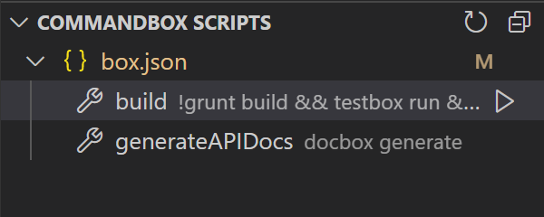
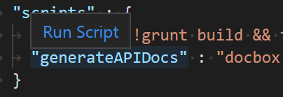
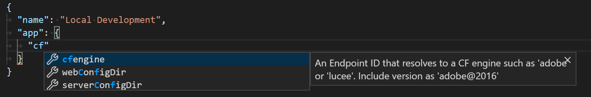
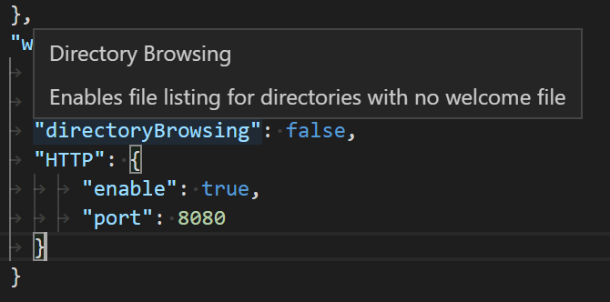
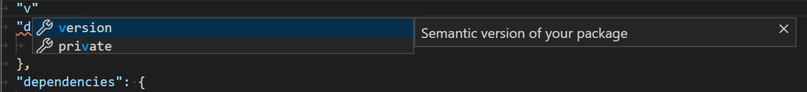
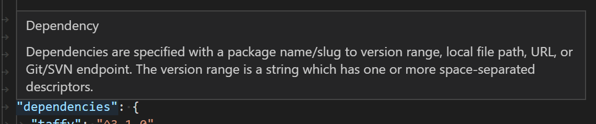
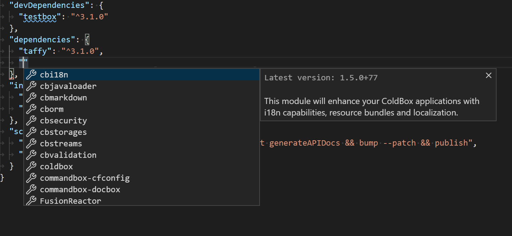
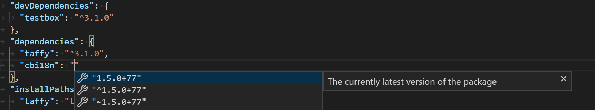
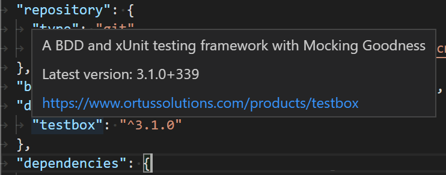

# VS Code CommandBox extension

Integrates [CommandBox](https://www.ortussolutions.com/products/commandbox) into VS Code. If you are new to CommandBox, check the [documentation](https://commandbox.ortusbooks.com/).

You are expected to have CommandBox installed on your system.

## Features

### Scripts

This extension supports running CommandBox scripts as [VS Code tasks](https://code.visualstudio.com/docs/editor/tasks). Scripts containing the name 'build', 'compile', or 'watch' are treated as build tasks. Any scripts defined in the `box.json` will be auto-detected by default and added as VS Code tasks. You can also annotate VS Code task definitions in your `tasks.json` files using the `type` as `commandbox` and `script` as the script name.

To run scripts as VS Code tasks, use the Task menu items or commands.

#### Script Explorer

The CommandBox Script Explorer shows the CommandBox scripts found in your workspace. The explorer view is enabled by the setting `commandbox.enableScriptExplorer`. A script can be opened or run from the explorer.

#### Run Scripts from the Editor

The extension supports to run the selected script as a VS Code task when editing the `box.json` file. You can either run a script from the hover shown on a script or using the command `commandbox: Run Selected Script`.

#### Run Scripts from a Folder in the Explorer

The extension supports running a script as a VS Code task from a folder in the Explorer. The command `commandbox: Run Script in Folder...` shown in the Explorer context menu finds all scripts in `box.json` files that are contained in this folder. You can then select the script to be executed as a task from the resulting list. You enable this support with the `commandbox.runScriptFromFolder` which is `false` by default.

### Editing server.json

#### Schema

The extension ships with a schema for the `server.json` file to provide auto-completion and information on hover for standard properties. To ensure it is kept up-to-date without having to update the extension, the latest schema in the GitHub `master` is pulled when the extension is activated.

##### Property Completion

##### Property Hover

### Editing box.json

#### Schema

The extension ships with a schema for the `box.json` file to provide auto-completion and information on hover for standard properties. To ensure it is kept up-to-date without having to update the extension, the latest schema in the GitHub `master` is pulled when the extension is activated.

##### Property Completion

##### Property Hover

#### Dependencies

The extension also fetches data from ForgeBox to provide auto-completion and information on hover features on dependencies.

##### Slug Completion

##### Version Completion

##### Hover

## Settings

- `commandbox.autoDetect` - Enable detecting scripts as VS Code tasks. [*Default*: `on`]
- `commandbox.exclude` - Glob patterns for folders that should be excluded from automatic script detection. The pattern is matched against the **absolute path** of the `box.json`. For example, to exclude all test folders use '&ast;&ast;/test/&ast;&ast;'.
- `commandbox.enableScriptExplorer` - Enable an explorer view for CommandBox scripts when there is no top-level `box.json` file. [*Default*: `false`]
- `commandbox.enableRunFromFolder` - Enable running CommandBox scripts from the context menu of folders in Explorer. [*Default*: `false`]
- `commandbox.scriptExplorerAction` - The default click action: `open` or `run`. [*Default*: `open`]
- `commandbox.buildNames` - When a VS Code task contains this as part of its name, it will be assigned as a build task. [*Default*: `["build", "compile", "watch"]`]
- `commandbox.testNames` - When a VS Code task name starts with this, it will be assigned as a test task. [*Default*: `["test"]`]
- `commandbox.forgebox.fetchOnlinePackageInfo` - Fetch data from ForgeBox to provide auto-completion and information on hover features on dependencies. [*Default*: `true`]
- `commandbox.forgebox.endpointUrl` - The URL for the ForgeBox endpoint. Customize for ForgeBox Enterprise. [*Default*: `https://www.forgebox.io`]

## Contributing

See [CONTRIBUTING.md](/CONTRIBUTING.md)
